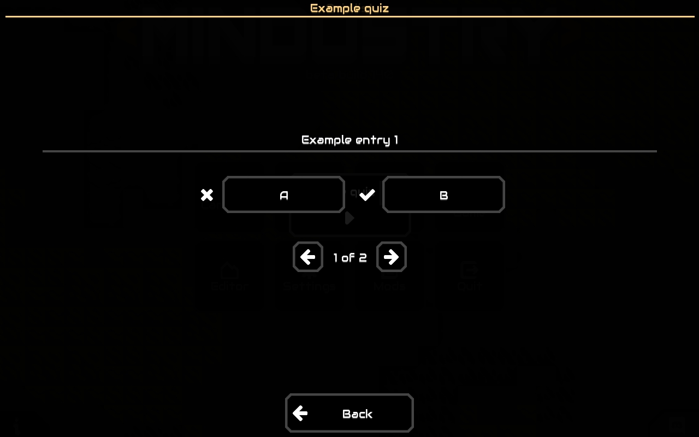
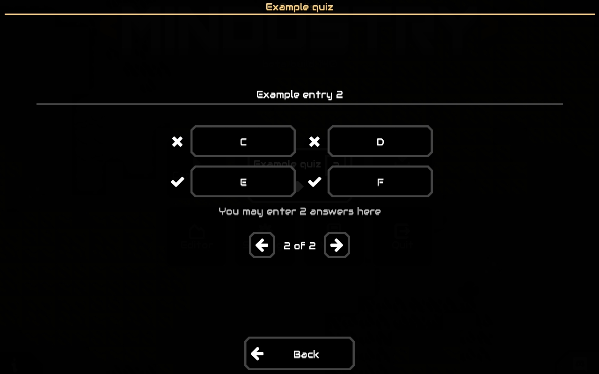
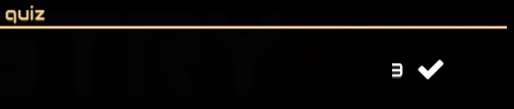

# quizdustry
A Mindustry library mod.

Here is a preview of the example quiz that exists in main.js (older version):

As of v0.2, there has been an update regarding quiz completion.
Now the correct answers are counted near the top-right corner of the dialog.

